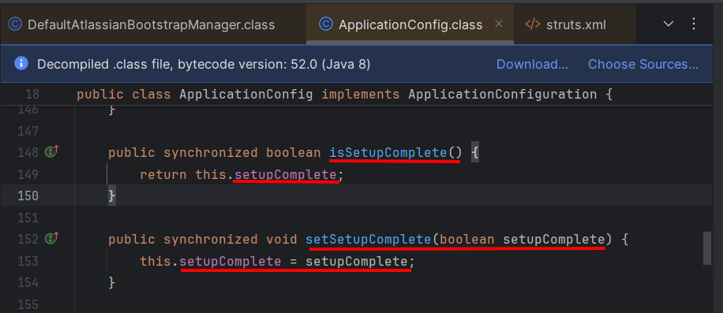

# CVE-2023-22515

## Thông tin chính về CVE-2023-22515

- **Sản phẩm ảnh hưởng:** Atlassian Confluence Data Center & Confluence Server.
    
- **Ngày công bố:** 04/10/2023.
    
- **Mức độ:** Critical (CVSS ~ 10.0).
    
- **Loại lỗ hổng:** Broken Access Control / Improper Authorization → cho phép attacker **tạo tài khoản admin từ xa**.
- Lỗi nằm ở **Confluence setup mechanism**

- **Ảnh hưởng:** Confluence Data Center & Server **8.0.0 → 8.5.1**.

## Triển khai tìm lỗi 

- Đầu tiên khi cài đặt **Confluence** sẽ có bước cấu hình cho máy chủ hoạt động ví dụ như là kết nối DATABASE, tạo người dùng, ... Những việc này được thực hiện thông qua trình duyệt WEB và các đường dẫn URL **/setup/**. Bước cuối cùng của cấu hình sẽ là **/setup/setupadministrator.action**. 
- Sau khi hoàn thành thành thì các thiệt lập sẽ không được gọi. Nếu chúng ta cố gọi thì nó sẽ hiền thị thông báo lỗi


- Điều này bắt nguồn từ Một trong những interceptor đó là `SetupCheckInterceptor` của `struts.xml`

	- `struts.xml` chính là file **cấu hình trung tâm** cho Struts.
    
	- Nó định nghĩa **cách Confluence map URL → Action class → View template**.
    
	- Đồng thời khai báo **interceptor** (các lớp chặn xử lý request trước/sau khi chạy action).


Trong `SetupCheckInterceptor` gọi `BootstrapUtils.getBootstrapManager().isSetupComplete()`

```java
public String intercept(ActionInvocation actionInvocation) throws Exception {
    if (BootstrapUtils.getBootstrapManager().isSetupComplete() && ContainerManager.isContainerSetup())
        return "alreadysetup"; 
    return actionInvocation.invoke();
}
```

**Giải thích**

- **`BootstrapUtils.getBootstrapManager().isSetupComplete()`**  
    → Kiểm tra xem Confluence đã hoàn tất quá trình setup (qua wizard, nhập license, tạo admin user) hay chưa.
    
- **`ContainerManager.isContainerSetup()`**  
    → Kiểm tra xem Spring IoC container đã được khởi tạo đầy đủ chưa.
    
- Nếu **cả hai điều kiện đều đúng**:  
    → Nghĩa là hệ thống **đã setup hoàn chỉnh** → interceptor **trả về `"alreadysetup"`** ngay lập tức.  
    → Không cho chạy tiếp action (thường là các action setup như `SetupDatabaseAction`, `SetupLicenseAction`, …).
    
- Nếu **chưa setup hoàn chỉnh**:  
    → Gọi `actionInvocation.invoke()` → tức là tiếp tục thực thi action mà người dùng request.

`getBootstrapManager()` → thường trả về **DefaultAtlassianBootstrapManager**
là quản lý toàn bộ thông tin cấu hình cốt lõi trong quá setup

- `DefaultAtlassianBootstrapManager.isSetupComplete`chúng ta có thể thấy rằng phương thức cấu hình ứng dụng `isSetupComplete`được gọi để kiểm tra xem quá trình thiết lập đã hoàn tất hay chưa.


=> Nếu chúng ta làm cho `isSetupComplete` = **False** thì `SetupCheckInterceptor`sẽ không trả về “alreadysetup” và `/setup/setupadministrator.action`sẽ có thể truy cập được.

Dưới đây chúng ta có một `ServerInfoAction`

- `ServerInfoAction` = Action công khai trong Confluence → cho phép mọi user gọi tới mà không cần login, không cần CSRF token. Khi chạy, nó chỉ trả về `"success"` → map tới một template hiển thị thông tin server.


- Nó được kế thừa từ `ConfluenceActionSupport`
- Trong `ConfluenceActionSupport` ta lại thấy `getBootstrapStatusProvider`trả về `BootstrapStatusProviderImpl`thể hiện mà chúng ta đang tìm kiếm


- Trong `BootstrapStatusProviderImpl`lại có `getApplicationConfig` để trả về cấu hình của ứng dụng


- Cuối cùng khi vào bên trong của `ApplicationConfig` thì có thể thấy được nó chiển khai kiểm tra `setSetupComplete`



- Kết hợp các phần trên lại thì chúng ta có thể suy ra một chuỗi các phương thức để chuyển `setSetupComplete` = **false**


```java
getBootstrapStatusProvider(). getApplicationConfig (). setSetupComplete ( false );
```


- XWorks2 sẽ cho phép chúng ta thực hiện chuỗi getter/setter kiểu này, chúng ta có thể xây dựng một tham số HTTP để triển khai chuỗi lệnh gọi phương thức trên bằng cách sử dụng ký hiệu mà XWorks2 yêu cầu

```java
bootstrapStatusProvider.applicationConfig.setupComplete=false
```

- Chúng ta sẽ lợi dụng `/server-info.action` là một URL trong Confluence, được sử lí bởi `ServerInfoAction` vì public endpoint không cần đăng nhập.

```java
/server-info.action?bootstrapStatusProvider.applicationConfig.setupComplete=false
```


Hãy kiểm tra Debug:

- **setupComplete (tham số truyền vào method)**  
    → `false`  
    Tức là method đang được gọi với tham số `false`.
    
- **this.setupComplete (biến instance của đối tượng ApplicationConfig)**  
    → `true` (trước khi gán).

- Khi lệnh chạy xong → `this.setupComplete` sẽ trở thành `false`.


- Sau khi hoàn thành bước trên thì chúng ta hãy thử vào lại enpoint `/setup/setupadministrator.action` và thành công


- Sau khi tạo hãy đăng nhập và kiểm tra lại quyền 


